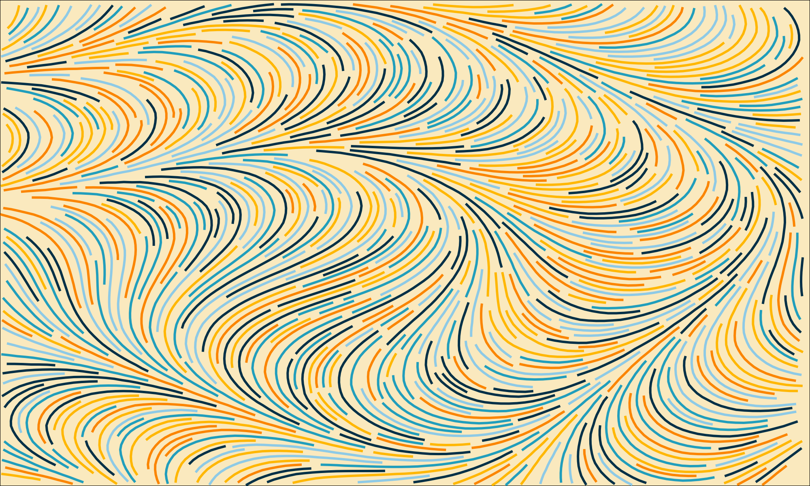

# lefer

A small C++ library for drawing evenly-spaced and non-overlapping curves in a flow field (also called of "vector field" in some contexts), using the Jobard and Lefer (1997) algorithm.
This algorithm is thoroughly described in a scientific paper ([Jobard and Lefer 1997](#references)), but you might find
[this article useful too](https://pedro-faria.netlify.app/posts/2024/2024-02-19-flow-even/en/index.html).




# How to build it?

This project is built by CMake. You can build the project by running:

```bash
cmake .
make
```

# Calculating curves

The functions from this library calculates all coordinates from each curve you want
to draw. They make sure that the coordinates from each curves does not collide (or overlap)
with the coordinates from other curves.

Very briefly, the idea behind the algorithm, is to draw a curve by walking through
the vector field, and constantly check if we are getting to close from neighbouring
curves. If we do get too close, then, we stop drawing the current curve, and
start to draw a different curve in a different position of the flow field.


# The main API

The core part of the Jobard and Lefer algorithm can be splitted in two parts:

- Drawing non-overlapping curves;
- Drawing evenly-spaced, and also, non-overlapping curves;


This library offers a single function for each part (`lefer::even_spaced_curves()` and `lefer::non_overlapping_curves()`).
So, if you want to draw curves that do not overlap each other, but you do not care about
how much far they are from each other, you probably want to use the `lefer::non_overlapping_curves()` function.
Otherwise, you use the `lefer::even_spaced_curves()`.

Both functions return a `std::vector` of `lefer::Curve` objects. Each `lefer::Curve` object represents a curve that
was drawn into the flow field.

# A minimal example

The complete example can be found inside the `examples` directory of this repository.
But just as a minimal example.

```cpp
int flow_field_width = 120;
int flow_field_height = 120;
int n_steps = 30;
int min_steps_allowed = 5;
double step_length = 0.01 * flow_field_width;
double d_sep = 0.8;
int n_curves = 1500;

double** flow_field;
flow_field = (double**)malloc(sizeof(double*) * flow_field_width);
for (int i = 0; i< flow_field_width; i++) {
	flow_field[i] = (double*)malloc(sizeof(double) * flow_field_height);
}

// Populate `flow_field` with noise values using any Noise Generator of
// your preference .... A classic example is to use the Perlin Noise algorithm
// to create these values.

lefer::FlowField flow_field_obj = lefer::FlowField(flow_field, flow_field_width);
lefer::DensityGrid density_grid = lefer::DensityGrid(flow_field_width, flow_field_height, d_sep, 2000);
	
double x_start = 45.0;
double y_start = 24.0;
std::vector<lefer::Curve> curves = lefer::even_spaced_curves(
	x_start,
	y_start,
	n_curves,
	n_steps,
	min_steps_allowed,
	step_length,
	d_sep,
	&flow_field_obj,
	&density_grid
);
```


## References

Jobard, Bruno, and Wilfrid Lefer. 1997. “Creating Evenly-Spaced Streamlines of Arbitrary Density.” In Visualization
    in Scientific Computing ’97, edited by Wilfrid Lefer and Michel Grave, 43–55. Vienna: Springer Vienna.
